# Student Placement & Recruitment Portal (VIT Placement Cell)

> **Academic Course Project for DBMS DA2 (Database Assessment 2)**  
> **Authoritative Database Engine**: Oracle Database 23ai Free / 21c XE (`FREEPDB1`)  
> **Backend Architecture**: Spring Boot 3.4.3 Modular Monolith (Java 21/26)  
> **Frontend Architecture**: React 19, Vite, Tailwind CSS v4, Monaco-style SQL Editor, Lucide Icons  
> **DevOps & Infrastructure**: Docker, Flyway Migrations (V1–V22), Actuator, Swagger UI  

---

## Table of Contents
1. [Master Project Overview](#1-master-project-overview)
2. [Authoritative Oracle Architecture (Zero Mock Policy)](#2-authoritative-oracle-architecture-zero-mock-policy)
3. [Relational Integrity & Normalization (DA1→DA2)](#3-relational-integrity--normalization-da1da2)
4. [PL/SQL Engine & Autonomic Database Objects](#4-plsql-engine--autonomic-database-objects)
5. [In-Browser Oracle SQL & PL/SQL Compiler](#5-in-browser-oracle-sql--plsql-compiler)
6. [User Personas & End-to-End Workflows](#6-user-personas--end-to-end-workflows)
7. [Quickstart & Live Execution](#7-quickstart--live-execution)
8. [Automated Verification & Test Suite](#8-automated-verification--test-suite)
9. [Documentation Index & Viva Guide](#9-documentation-index--viva-guide)

---

## 1. Master Project Overview

The **VIT Student Placement & Recruitment Portal** is a production-grade enterprise DBMS application engineered to automate the end-to-end campus recruitment lifecycle. Built to satisfy the rigorous requirements of **DBMS DA2**, the portal pairs an authoritative **Oracle Database 23ai** instance with a reactive Spring Boot backend and an institutionally themed React 19 interface.

### Core Objectives Achieved
- **Single Source of Truth**: 100% of data—student profiles, academic program catalogs, placement drives, resume BLOBs, round evaluations, offers, and audit logs—originates from Oracle Database 23ai. Zero runtime mock arrays or client-side fallback stubs.
- **Enterprise Transactional Workflows**: ACID transactional procedures (`REGISTER_STUDENT_PROGRAM`, `APPLY_FOR_DRIVE`, `SCHEDULE_INTERVIEW`, `ISSUE_OFFER`) with deterministic rollback semantics.
- **Interactive Faculty Demonstration**: In-portal SQL/PLSQL Compiler with `DBMS_OUTPUT` streaming, `ResultSetMetaData` column projection, and Oracle Data Dictionary schema explorer.

---

## 2. Authoritative Oracle Architecture (Zero Mock Policy)

The following system architecture flowchart illustrates the end-to-end stack topology—from client-side personas and React 19 UI down through the Spring Boot 3.4 modular monolith, dual persistence layer, authoritative Oracle Database 23ai engine, automated PL/SQL procedures, and containerized runtime infrastructure:

```mermaid
flowchart TD
    %% ============================================================
    %% 1. PRESENTATION LAYER (CLIENT TIER)
    %% ============================================================
    subgraph PresentationTier ["1. Presentation Layer (Client Tier - Port 3000)"]
        direction TB

        subgraph UserPersonas ["Authenticated User Personas"]
            StudentRole["🎓 Student Persona (ROLE_STUDENT)<br/>• Resume BLOB Upload & Verification<br/>• Drive Eligibility Check & 1/Day Apply<br/>• Offer Acceptance & PDF Download"]
            RecruiterRole["🏢 Recruiter Persona (ROLE_RECRUITER)<br/>• Drive Applicant Tracking Pipeline<br/>• Multi-Round Technical Scoring<br/>• Official Employment Offer Issuance"]
            AdminRole["🛡️ Admin / Faculty (ROLE_ADMIN)<br/>• Placement Analytics KPI Dashboard<br/>• Live Audit Journal Inspection<br/>• In-Browser SQL / PLSQL Compiler"]
        end

        subgraph FrontendCore ["React 19 + Vite Frontend SPA"]
            UIComponents["React 19 Core & React Router v7<br/>• Tailwind CSS v4 & Lucide Icons<br/>• Monaco-Style SQL & PL/SQL Editor<br/>• Real-Time DBMS_OUTPUT Console Stream"]
            ApiClient["HTTP API Client & Vite Proxy<br/>• Vite Reverse Proxy (/api ➔ :8080)<br/>• Stateless JWT Bearer Token Injection<br/>• Unified Response & Error Interceptor"]
            UIComponents --> ApiClient
        end

        StudentRole --> UIComponents
        RecruiterRole --> UIComponents
        AdminRole --> UIComponents
    end

    %% ============================================================
    %% TRANSPORT LAYER
    %% ============================================================
    ApiClient -->|"HTTPS / REST (JSON) + JWT Bearer Token"| SecurityFilter

    %% ============================================================
    %% 2. APPLICATION BACKEND LAYER (SPRING BOOT 3.4.3 MONOLITH)
    %% ============================================================
    subgraph BackendTier ["2. Application Layer (Spring Boot 3.4.3 Modular Monolith - Port 8080 / Java 21)"]
        direction TB

        subgraph SecurityModule ["Spring Security 6.x & JWT Gateway"]
            SecurityFilter["Stateless JWT Authentication Filter<br/>• jjwt (io.jsonwebtoken 0.12.6)<br/>• BCrypt Password Encryption (12 Salt Rounds)<br/>• Method Security: @PreAuthorize (RBAC)"]
        end

        subgraph DispatcherModule ["Spring MVC Dispatcher & REST Controllers (/api/v1/*)"]
            DispatcherServlet["Spring MVC DispatcherServlet<br/>• URI Routing & Content Negotiation"]
            CtrlAuth["AuthController<br/>• /api/v1/auth (Login, Register, Token Refresh)"]
            CtrlStudent["Student & ResumeController<br/>• /api/v1/students (Profiles, BLOB Upload/Stream)"]
            CtrlRecruit["PlacementDrive & RecruiterController<br/>• /api/v1/drives, /api/v1/recruiter (Applications, Shortlisting)"]
            CtrlApp["Application & InterviewController<br/>• /api/v1/applications, /api/v1/interviews (Stages, Rounds)"]
            CtrlOffer["OfferController<br/>• /api/v1/offers (Apache PDFBox Dynamic Letters)"]
            CtrlCompiler["SqlCompilerController<br/>• /api/v1/admin/sql (Dynamic ResultSetMetaData & Output)"]
            CtrlReports["Report & AdminController<br/>• /api/v1/reports, /api/v1/admin (KPIs, Audit Logs)"]

            DispatcherServlet --> CtrlAuth
            DispatcherServlet --> CtrlStudent
            DispatcherServlet --> CtrlRecruit
            DispatcherServlet --> CtrlApp
            DispatcherServlet --> CtrlOffer
            DispatcherServlet --> CtrlCompiler
            DispatcherServlet --> CtrlReports
        end

        subgraph ServiceModule ["Service Layer (@Transactional Business Boundaries)"]
            DomainServices["Modular Domain Services<br/>• AuthService, StudentService, ProgramService<br/>• RecruitmentService, ApplicationService<br/>• InterviewService, OfferService, ReportService<br/>• SqlCompilerService (DBMS_OUTPUT Buffer Extraction)"]
        end

        subgraph PersistenceModule ["Dual-Access Persistence Layer"]
            JPAAccess["Spring Data JPA / Hibernate<br/>• Standard CRUD & Relational Mapping<br/>• Entity Lifecycle Management<br/>• Declarative Cascades & Fetch Strategies"]
            JDBCAccess["Spring JDBC (JdbcTemplate & SimpleJdbcCall)<br/>• Transactional PL/SQL Stored Procedures<br/>• Analytical Functions & Ref Cursors<br/>• Dynamic SQL Compiler Execution"]
        end

        SecurityFilter --> DispatcherServlet
        CtrlAuth --> DomainServices
        CtrlStudent --> DomainServices
        CtrlRecruit --> DomainServices
        CtrlApp --> DomainServices
        CtrlOffer --> DomainServices
        CtrlCompiler --> DomainServices
        CtrlReports --> DomainServices
        DomainServices --> JPAAccess
        DomainServices --> JDBCAccess
    end

    %% ============================================================
    %% DATABASE CONNECTION POOL
    %% ============================================================
    JPAAccess -->|"HikariCP Connection Pool (OJDBC 11 Driver)"| NetListener
    JDBCAccess -->|"ACID PL/SQL Dispatch & Ref Cursor Streaming"| NetListener

    %% ============================================================
    %% 3. ORACLE DATABASE 23ai FREE ENGINE
    %% ============================================================
    subgraph DatabaseTier ["3. Authoritative Database Engine (Oracle Database 23ai Free / 21c XE - Port 1521)"]
        direction TB

        NetListener["Oracle Net Listener (Port 1521 / Service: FREEPDB1)<br/>• Dedicated Server Process Architecture"]

        subgraph PDBEngine ["Pluggable Database: FREEPDB1"]
            subgraph RelationalTables ["27 Relational Tables (BCNF Normalized Schema)"]
                AcademicData["Academic Core Tables<br/>• STUDENT, PROGRAM, BATCH<br/>• STUDENT_PHONE, REGISTERS<br/>• STUDENT_RESUME (PDF Stored as BLOB)"]
                RecruitmentData["Recruitment & Eligibility Tables<br/>• COMPANY, JOB_POSTING<br/>• PLACEMENT_DRIVE, DRIVE_ELIGIBILITY<br/>• STUDENT_DAILY_ROUTINE_DRIVE"]
                PipelineData["Evaluation & Offers Tables<br/>• APPLICATION, INTERVIEW<br/>• INTERVIEWER_ROUND, RESUME_EVALUATION<br/>• OFFER_LETTER, OFFER_ACCEPTANCE"]
                AuditData["System Audit Journal<br/>• APPLICATION_AUDIT"]
            end

            subgraph PLSQLSubsystem ["PL/SQL Autonomic Engine"]
                Procedures["Transactional Stored Procedures<br/>• REGISTER_STUDENT_PROGRAM (Prereq & Batch Assign)<br/>• APPLY_FOR_DRIVE (CGPA & 1/Day Rule with Savepoint)<br/>• SCHEDULE_INTERVIEW (Round Routing & Pinning)<br/>• ISSUE_OFFER (Atomic Stage & Offer Sync)"]
                Functions["Computational Functions & Ref Cursors<br/>• GET_PLACEMENT_RATE() (Live Percentage Calculation)<br/>• GET_AVERAGE_PACKAGE() (Aggregated Mean CTC)<br/>• GET_ELIGIBLE_STUDENTS() (SYS_REFCURSOR)"]
                Triggers["Autonomic Database Triggers<br/>• TRG_OFFER_APPLICATION_STATUS (Auto-transitions status)<br/>• TRG_APPLICATION_AUDIT (Before/After journal records)<br/>• TRG_OFFER_ACCEPTANCE_ATOMIC (Single-offer lock)"]
            end

            subgraph AnalyticsData ["Analytical Views & Data Dictionary"]
                Views["Analytical Views<br/>• VW_PLACEMENT_SUMMARY, VW_STUDENT_ELIGIBILITY<br/>• VW_DRIVE_METRICS, VW_OFFER_ANALYSIS"]
                Dict["Oracle Data Dictionary (Metadata Catalog)<br/>• USER_TABLES, USER_VIEWS, USER_OBJECTS<br/>• USER_CONSTRAINTS, USER_TAB_COLS"]
            end
        end

        subgraph MigrationSubsystem ["Database Schema Evolution"]
            FlywayEngine["Flyway Migration Engine (flyway-core + flyway-database-oracle)<br/>• V1-V22 Versioned Incremental DDL/DML Migrations<br/>• Repeatable Functions, Procedures & Triggers"]
        end

        NetListener --> AcademicData
        NetListener --> RecruitmentData
        NetListener --> PipelineData
        NetListener --> AuditData
        NetListener --> Procedures
        NetListener --> Functions
        NetListener --> Views
        NetListener --> Dict

        Procedures --> PipelineData
        Triggers --> PipelineData
        Triggers --> AuditData

        FlywayEngine -.->|"Initializes & Migrates Database Schema"| NetListener
    end

    %% ============================================================
    %% 4. DEVOPS, RUNTIME & OBSERVABILITY
    %% ============================================================
    subgraph DevOpsTier ["4. DevOps, Infrastructure & Observability"]
        DockerContainer["Docker Container Engine<br/>• oracle-free (Oracle Database 23ai Free Image @ Port 1521)"]
        LauncherScript["./run_portal.sh<br/>• Environment Pre-flight & Port Probing<br/>• Full-Stack Background Process Launcher"]
        ActuatorMetrics["Spring Boot Actuator & Micrometer<br/>• /actuator/health (Health Indicator)<br/>• /actuator/prometheus (JVM & DB Metrics)"]
        OpenApiDocs["Springdoc OpenAPI 3.0 & Swagger UI<br/>• /swagger-ui.html (Interactive API Spec)"]

        DockerContainer -.->|"Containers Database Instance"| NetListener
        LauncherScript -.->|"1. Verifies Oracle Listener"| DockerContainer
        LauncherScript -.->|"2. Runs mvn spring-boot:run"| SecurityFilter
        LauncherScript -.->|"3. Runs npm run dev"| UIComponents
        DispatcherServlet -.-> ActuatorMetrics
        DispatcherServlet -.-> OpenApiDocs
    end

    %% ============================================================
    %% CLASS STYLING
    %% ============================================================
    classDef client fill:#e0f2fe,stroke:#0284c7,stroke-width:2px,color:#0369a1;
    classDef backend fill:#fef3c7,stroke:#d97706,stroke-width:2px,color:#92400e;
    classDef db fill:#fee2e2,stroke:#dc2626,stroke-width:2px,color:#991b1b;
    classDef infra fill:#f3e8ff,stroke:#9333ea,stroke-width:2px,color:#6b21a8;

    class StudentRole,RecruiterRole,AdminRole,UIComponents,ApiClient client;
    class SecurityFilter,DispatcherServlet,CtrlAuth,CtrlStudent,CtrlRecruit,CtrlApp,CtrlOffer,CtrlCompiler,CtrlReports,DomainServices,JPAAccess,JDBCAccess backend;
    class NetListener,AcademicData,RecruitmentData,PipelineData,AuditData,Procedures,Functions,Triggers,Views,Dict,FlywayEngine db;
    class DockerContainer,LauncherScript,ActuatorMetrics,OpenApiDocs infra;
```



### High-Level Topology Schematic

```
                              [ USER WEB BROWSER / CLIENT ]
                                            |
              +-----------------------------+-----------------------------+
              |                             |                             |
       /student portal               /recruiter portal             /admin & SQL compiler
              |                             |                             |
              +-----------------------------+-----------------------------+
                                            |
                                   [ REACT 19 + VITE ]
                                (Port 3000 / Proxy /api)
                                            |  REST / JWT Bearer
                                            v
                         [ SPRING BOOT 3.4 MODULAR MONOLITH ]
                                (Port 8080 / Java 21)
                                            |
             +------------------------------+------------------------------+
             |                              |                              |
      [ Spring Security ]         [ JPA Repositories ]           [ Spring JDBC DAO ]
         (BCrypt + JWT)         (Entities & Domain Logic)      (PL/SQL Stored Procedures)
             |                              |                              |
             +------------------------------+------------------------------+
                                            |
                                            v
                            [ ORACLE DATABASE 23ai FREE ]
                              (Port 1521 / PDB: FREEPDB1)
                     ---------------------------------------------
                     • 27 Normalized Relational Tables (BCNF)
                     • 5 Analytical Views
                     • 4 Transactional Stored Procedures
                     • 4 Computational Functions & Ref Cursors
                     • 5 Autonomic Triggers & Audit Journal
                     • 54 Performance B-Tree Indexes
                     • 22 Flyway Versioned Migrations
```

---

## 3. Relational Integrity & Normalization (DA1→DA2)

The database schema strictly adheres to the scanned handwritten DA1 relational specifications and 1NF ➔ 2NF ➔ 3NF ➔ BCNF proofs:

1. **Composite Batch Scoping**: `BATCH(Program_Id, Batch_No)` primary key scopes batch numbers uniquely to their degree program.
2. **Pinned Interviewer Round Model**: `INTERVIEWER_ROUND(Interviewer_Name PK, Interview_Round_No)` enforces the functional dependency `Interviewer_Name → Interview_Round_No`.
3. **Daily Routine Drive Constraint**: `STUDENT_DAILY_ROUTINE_DRIVE(Student_Id, Apply_Date, Drive_Id)` enforces institutional policy restricting students to at most 1 drive application per calendar day.
4. **Program Eligibility Junction**: `DRIVE_ELIGIBILITY(Drive_Id, Program_Id)` maps recruitment drives directly to canonical academic degree programs (`BTECH-CSE`, `BTECH-IT`, `BCE`, etc.).
5. **Resume BLOB Storage**: `STUDENT_RESUME` stores PDF resumes directly as Oracle `BLOB` datatypes with strict MIME verification and binary version tracking.

---

## 4. PL/SQL Engine & Autonomic Database Objects

| Type | Object Name | Purpose & Business Rules |
|------|-------------|--------------------------|
| **Procedure** | `REGISTER_STUDENT_PROGRAM` | Validates student prerequisites and atomically registers student into program batches. |
| **Procedure** | `APPLY_FOR_DRIVE` | Enforces CGPA thresholds, program eligibility, and 1-per-day application limits with `SAVEPOINT`. |
| **Procedure** | `SCHEDULE_INTERVIEW` | Coordinates multi-round evaluations, interview mode (Online/Offline), and pins interviewers. |
| **Procedure** | `ISSUE_OFFER` | Validates candidate stage (`SELECTED`/`INTERVIEWING`), writes offer, and fires triggers. |
| **Function** | `GET_PLACEMENT_RATE()` | Computes institutional placement percentage live across active graduates. |
| **Function** | `GET_AVERAGE_PACKAGE()` | Calculates average CTC across all finalized acceptance records. |
| **Trigger** | `TRG_OFFER_APPLICATION_STATUS` | Automatically transitions `APPLICATION.Status` to `OFFERED` upon offer generation. |
| **Trigger** | `TRG_APPLICATION_AUDIT` | Writes before/after status mutations into `APPLICATION_AUDIT` journal with timestamps and user info. |
| **Trigger** | `TRG_OFFER_ACCEPTANCE_ATOMIC` | Enforces single-offer acceptance by atomically declining competing active offers. |

---

## 5. In-Browser Oracle SQL & PL/SQL Compiler

Located at `http://localhost:3000/admin/sql`, the in-browser compiler enables live database interaction during faculty evaluations:

- **Full Oracle Dialect Support**: Executes DQL (`SELECT`), DML (`INSERT`, `UPDATE`, `DELETE`), DDL (`CREATE`, `ALTER`), and PL/SQL blocks (`DECLARE ... BEGIN ... END;`).
- **Live `DBMS_OUTPUT` Streaming**: Captures `DBMS_OUTPUT.PUT_LINE` buffer in real time and renders formatted console output.
- **Dynamic Meta Projection**: Uses JDBC `ResultSetMetaData` to dynamically construct column headers, datatypes, and tabular results for any arbitrary query.
- **Schema Explorer**: Inspects live tables, columns, constraints, views, stored procedures, functions, and triggers directly from the Oracle Data Dictionary (`USER_TABLES`, `USER_VIEWS`, `USER_OBJECTS`).

---

## 6. User Personas & End-to-End Workflows

### Authentication Personas

| Persona | Username | Password | Role | Entity Mapping | Key Capabilities |
|---------|----------|----------|------|----------------|------------------|
| **Student** | `25bce1799` | `password123` | `ROLE_STUDENT` | `STU023` (Achyut Ranaut, CGPA 9.20, B.Tech CSE) | Upload BLOB resume, check drive eligibility, apply for drives, track pipeline, accept offers, download PDF offer letters. |
| **Recruiter** | `recruiter1` | `password123` | `ROLE_RECRUITER` | `COM004` (Microsoft India) & `COM001` (TCS) | View applicants, schedule interview rounds, score technical stages, issue official employment offers. |
| **Admin** | `admin` | `admin123` | `ROLE_ADMIN` | Placement Cell Headquarters | View analytics KPI dashboard, inspect audit journal, execute queries in Oracle SQL Compiler. |

### End-to-End Operational Lifecycle
1. **Resume Submission**: Student uploads PDF resume ➔ stored in Oracle `STUDENT_RESUME.Resume_Data` as binary `BLOB`.
2. **Drive Application**: Student checks drive requirements ➔ PL/SQL `APPLY_FOR_DRIVE` verifies CGPA and program compatibility ➔ records entry in `APPLICATION` and `STUDENT_DAILY_ROUTINE_DRIVE`.
3. **Interview Progression**: Recruiter schedules technical rounds ➔ assigns pinned interviewers ➔ records scores in `INTERVIEW` and `RESUME_EVALUATION`.
4. **Offer Issuance**: Recruiter executes `ISSUE_OFFER` ➔ creates `OFFER_LETTER` entry with canonical drive CTC ➔ status transitions to `OFFERED`.
5. **Atomic Acceptance**: Student accepts offer ➔ candidate status becomes `PLACED` ➔ competing offers are atomically declined ➔ official PDF offer letter generated dynamically.

---

## 7. Quickstart & Live Execution

### One-Command Full Stack Launcher
To launch the complete infrastructure (Oracle Database check, Spring Boot backend on port 8080, and React Vite frontend on port 3000):

```bash
./run_portal.sh
```

### Manual Component Launch

#### 1. Verify Oracle Database Container
```bash
docker start oracle-free
# Verify listener on port 1521
nc -z localhost 1521
```

#### 2. Start Spring Boot Backend (Port 8080)
```bash
cd backend
mvn spring-boot:run -Dspring-boot.run.profiles=oracle
```

#### 3. Start React Frontend (Port 3000)
```bash
cd frontend
npm run dev
```

### Service Access URLs
- **Web Portal**: [http://localhost:3000](http://localhost:3000)
- **Student Dashboard**: [http://localhost:3000/student](http://localhost:3000/student)
- **Recruiter Pipeline**: [http://localhost:3000/recruiter](http://localhost:3000/recruiter)
- **Placement Admin & Analytics**: [http://localhost:3000/admin](http://localhost:3000/admin)
- **In-Portal SQL Compiler**: [http://localhost:3000/admin/sql](http://localhost:3000/admin/sql)
- **Swagger UI API Documentation**: [http://localhost:8080/swagger-ui.html](http://localhost:8080/swagger-ui.html)
- **Actuator Health Metrics**: [http://localhost:8080/actuator/health](http://localhost:8080/actuator/health)

---

## 8. Automated Verification & Test Suite

### Backend Unit & Integration Tests (89 Tests)
```bash
cd backend
mvn test
```
**Results**: **89 / 89 tests passing (0 failures, 0 errors)** covering PL/SQL simulations, JWT authorization, transactional integrity, resume BLOB handling, and database reports.

### Frontend Production Build
```bash
cd frontend
npm run build
```
**Results**: Clean production compilation with zero errors.

---

## 9. Documentation Index & Viva Guide

- [System Architecture Specification](docs/architecture.md)
- [DA1 Analysis & Normalization Proofs](docs/da1-analysis.md)
- [Locked DA1/DA2 Decisions Record](docs/da1-da2-decisions.md)
- [Database & PL/SQL Engine Reference](docs/database.md)
- [REST API Specification](docs/api.md)
- [Setup & Installation Guide](docs/setup.md)
- [Testing Strategy & Test Suite](docs/testing.md)
- [Academic Demonstration & Viva Guide](docs/demo-guide.md)
