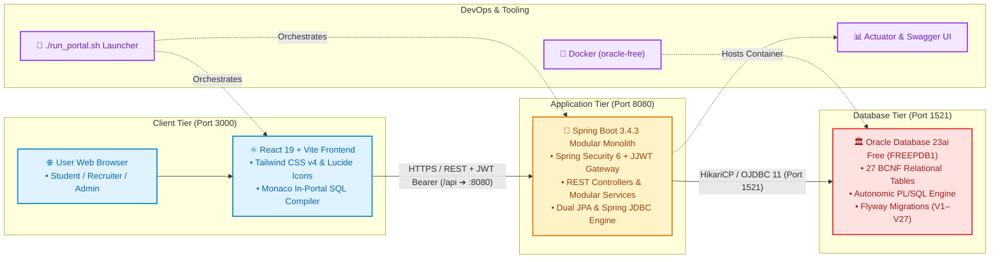
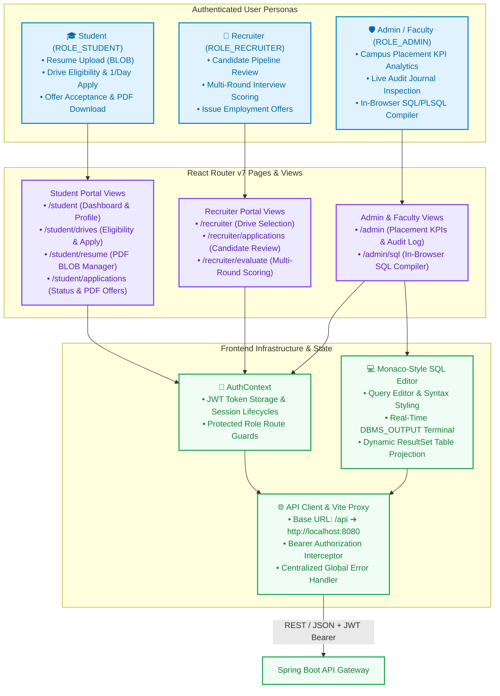
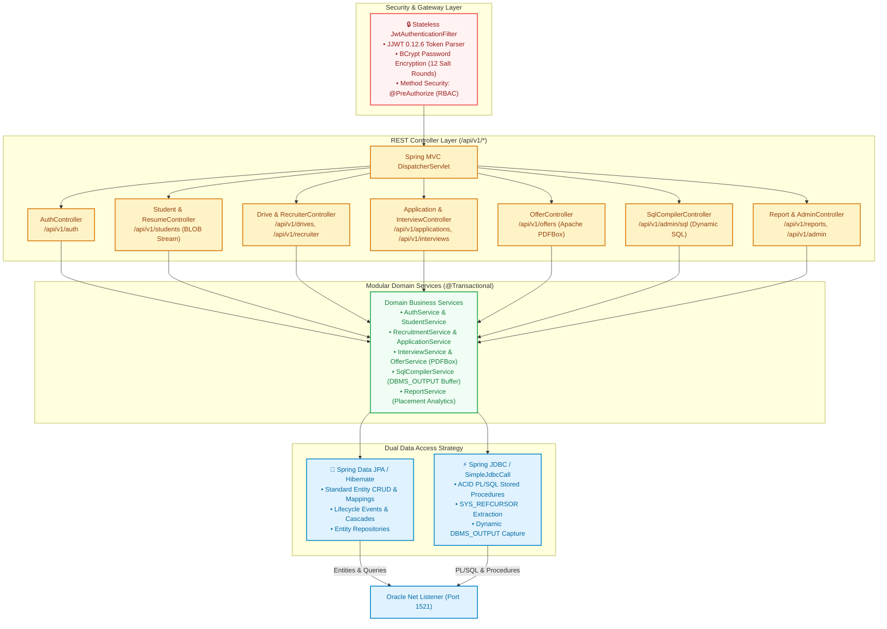
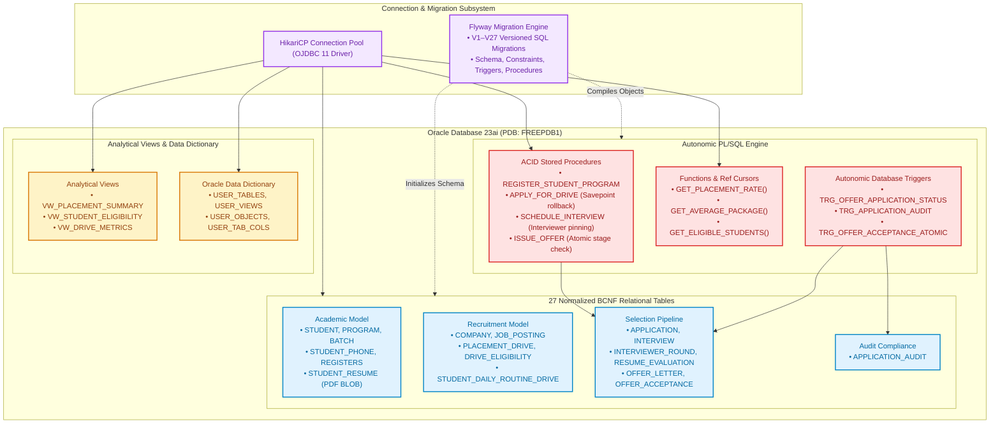

# 🎓 Student Placement & Recruitment Portal (VIT Placement Cell)

> **Academic Course Project for DBMS DA2 (Database Assessment 2)**  
> An enterprise-grade, full-stack campus recruitment and placement automation platform engineered with an authoritative Oracle Database 23ai engine, a reactive Spring Boot 3.4 modular monolith, and an institutionally themed React 19 interface.

<p align="center">
  
  
  
  
  
  
  
  
  
</p>

---

## 📑 Table of Contents
1. [Master Project Overview](#-master-project-overview)
2. [Key Features](#-key-features)
3. [System Architecture](#️-system-architecture)
   - [3.1 High-Level End-to-End System Topology](#31-high-level-end-to-end-system-topology)
   - [3.2 Frontend Architecture & User Personas Flow](#32-frontend-architecture--user-personas-flow)
   - [3.3 Backend Modular Monolith & Dual Persistence](#33-backend-modular-monolith--dual-persistence)
   - [3.4 Authoritative Oracle 23ai Engine & PL/SQL Pipeline](#34-authoritative-oracle-23ai-engine--plsql-pipeline)
4. [Relational Integrity & PL/SQL Engine](#-relational-integrity--plsql-engine)
5. [In-Browser Oracle SQL & PL/SQL Compiler](#-in-browser-oracle-sql--plsql-compiler)
6. [User Personas & End-to-End Workflows](#-user-personas--end-to-end-workflows)
7. [Repository Structure](#-repository-structure)
8. [Getting Started & Live Execution](#-getting-started--live-execution)
9. [Automated Verification & Test Suite](#-automated-verification--test-suite)
10. [Documentation Index & Viva Guide](#-documentation-index--viva-guide)
11. [Academic Declaration & License](#-academic-declaration--license)

---

## 🌟 Master Project Overview

The **VIT Student Placement & Recruitment Portal** is a production-grade enterprise DBMS application engineered to automate the end-to-end campus recruitment lifecycle. Built to satisfy the rigorous requirements of **DBMS DA2**, the portal pairs an authoritative **Oracle Database 23ai** instance with a reactive Spring Boot backend and an institutionally themed React 19 interface.

### Core Architectural Directives
- **Zero Mock Policy**: 100% of data—student profiles, academic program catalogs, placement drives, resume BLOBs, round evaluations, offers, and audit logs—originates from Oracle Database 23ai (`FREEPDB1`). Zero runtime mock arrays or client-side fallback stubs.
- **Enterprise Transactional Workflows**: ACID transactional procedures (`REGISTER_STUDENT_PROGRAM`, `APPLY_FOR_DRIVE`, `SCHEDULE_INTERVIEW`, `ISSUE_OFFER`) with deterministic rollback semantics and savepoints.
- **Interactive Faculty Demonstration**: In-portal SQL/PLSQL Compiler with `DBMS_OUTPUT` streaming, `ResultSetMetaData` dynamic column projection, and live Oracle Data Dictionary schema exploration.

---

## 🌟 Key Features

- **Authoritative Oracle 23ai Core (Zero Mock Policy)**: Single source of truth across 27 normalized relational tables, 5 analytical views, and an autonomic audit journal.
- **BCNF Relational Normalization**: Strict schema adherence to scanned handwritten DA1 specifications with functional dependency proofs (`BATCH(Program_Id, Batch_No)`, `INTERVIEWER_ROUND(Interviewer_Name PK, Round_No)`, and `STUDENT_DAILY_ROUTINE_DRIVE` 1-drive/day integrity).
- **Dual Persistence Strategy**: Clean architectural separation utilizing **Spring Data JPA** for entity lifecycle mapping and **Spring JDBC (`SimpleJdbcCall`)** for native PL/SQL stored procedure dispatch and cursor streaming.
- **ACID PL/SQL Engine**: Transactional stored procedures with deterministic rollback semantics, input constraint validation, and programmatic `SAVEPOINT` safety.
- **Autonomic Database Triggers**: Reactive triggers enforcing offer state-machine transitions (`TRG_OFFER_APPLICATION_STATUS`), before/after mutation journaling (`TRG_APPLICATION_AUDIT`), and single-offer atomic exclusivity (`TRG_OFFER_ACCEPTANCE_ATOMIC`).
- **In-Browser Monaco SQL & PL/SQL Compiler**: Dedicated IDE terminal (`/admin/sql`) executing arbitrary DQL, DML, DDL, and PL/SQL blocks with real-time `DBMS_OUTPUT.PUT_LINE` buffer capture and dynamic tabular rendering.
- **Binary Resume BLOB Storage**: Student PDF resumes are stored directly in Oracle `STUDENT_RESUME.Resume_Data` as binary `BLOB` datatypes with MIME verification and on-the-fly byte streaming.
- **Dynamic Offer Letter PDF Generation**: Server-side Apache PDFBox engine dynamically compiling branded institutional employment offer letters upon candidate selection and acceptance.
- **Security-Hardened Stateless JWT Gateway**: Spring Security 6.x with stateless JJWT bearer verification, 12-round BCrypt password hashing, and role-based access control (`ROLE_STUDENT`, `ROLE_RECRUITER`, `ROLE_ADMIN`).
- **Observable DevOps Pipeline**: Dockerized Oracle 23ai instance, Flyway incremental database migrations (V1–V27), Spring Boot Actuator health/Prometheus metrics, and interactive OpenAPI 3.0 / Swagger UI documentation.

---

## 🏗️ System Architecture

To prevent visual clutter and provide immediate architectural clarity, the system architecture is decomposed into four focused diagrams:

1. **[High-Level End-to-End System Topology](#31-high-level-end-to-end-system-topology)** (Macro 4-tier flow)
2. **[Frontend Architecture & User Personas Flow](#32-frontend-architecture--user-personas-flow)** (Client SPA and routing)
3. **[Backend Modular Monolith & Dual Persistence](#33-backend-modular-monolith--dual-persistence)** (Spring Boot, Security, JPA & JDBC)
4. **[Authoritative Oracle 23ai Engine & PL/SQL Pipeline](#34-authoritative-oracle-23ai-engine--plsql-pipeline)** (Database internals, BCNF schema & procedures)

---

### 3.1 High-Level End-to-End System Topology

A macro view illustrating the request lifecycle across client, application server, authoritative database, and DevOps orchestration:



---

### 3.2 Frontend Architecture & User Personas Flow

The client-side architecture showing role-based entry points, SPA view routes, state management, and the Monaco-style SQL terminal:



---

### 3.3 Backend Modular Monolith & Dual Persistence

The Spring Boot backend architecture showcasing the security gateway, REST controllers, transactional domain services, and dual JPA/JDBC persistence:



---

### 3.4 Authoritative Oracle 23ai Engine & PL/SQL Pipeline

The database tier architecture depicting connection pooling, 27 BCNF tables, autonomic PL/SQL procedures/triggers, analytical views, and Flyway schema evolution:



---

## 📊 Relational Integrity & PL/SQL Engine

The database schema strictly adheres to the scanned handwritten DA1 relational specifications and 1NF ➔ 2NF ➔ 3NF ➔ BCNF proofs:

1. **Composite Batch Scoping**: `BATCH(Program_Id, Batch_No)` primary key scopes batch numbers uniquely to their degree program.
2. **Pinned Interviewer Round Model**: `INTERVIEWER_ROUND(Interviewer_Name PK, Interview_Round_No)` enforces the functional dependency `Interviewer_Name → Interview_Round_No`.
3. **Daily Routine Drive Constraint**: `STUDENT_DAILY_ROUTINE_DRIVE(Student_Id, Apply_Date, Drive_Id)` enforces institutional policy restricting students to at most 1 drive application per calendar day.
4. **Program Eligibility Junction**: `DRIVE_ELIGIBILITY(Drive_Id, Program_Id)` maps recruitment drives directly to canonical academic degree programs (`BTECH-CSE`, `BTECH-IT`, `BCE`, etc.).
5. **Resume BLOB Storage**: `STUDENT_RESUME` stores PDF resumes directly as Oracle `BLOB` datatypes with strict MIME verification and binary version tracking.

### Autonomic PL/SQL Objects & Business Rules

| Type | Object Name | Purpose & Business Rules |
|------|-------------|--------------------------|
| **Procedure** | `REGISTER_STUDENT_PROGRAM` | Validates student prerequisites and atomically registers student into program batches. |
| **Procedure** | `APPLY_FOR_DRIVE` | Enforces CGPA thresholds, program eligibility, and 1-per-day application limits with `SAVEPOINT` rollback. |
| **Procedure** | `SCHEDULE_INTERVIEW` | Coordinates multi-round evaluations, interview mode (Online/Offline), and pins interviewers. |
| **Procedure** | `ISSUE_OFFER` | Validates candidate stage (`SELECTED`/`INTERVIEWING`), writes offer, and fires triggers. |
| **Function** | `GET_PLACEMENT_RATE()` | Computes institutional placement percentage live across active graduates. |
| **Function** | `GET_AVERAGE_PACKAGE()` | Calculates average CTC across all finalized acceptance records. |
| **Function** | `GET_ELIGIBLE_STUDENTS()` | Returns a dynamic `SYS_REFCURSOR` of eligible students for a drive. |
| **Trigger** | `TRG_OFFER_APPLICATION_STATUS` | Automatically transitions `APPLICATION.Status` to `OFFERED` upon offer generation. |
| **Trigger** | `TRG_APPLICATION_AUDIT` | Writes before/after status mutations into `APPLICATION_AUDIT` journal with timestamps and user info. |
| **Trigger** | `TRG_OFFER_ACCEPTANCE_ATOMIC` | Enforces single-offer acceptance by atomically declining competing active offers. |

---

## 💻 In-Browser Oracle SQL & PL/SQL Compiler

Located at `http://localhost:3000/admin/sql`, the in-browser compiler enables live database interaction during faculty evaluations:

- **Full Oracle Dialect Support**: Executes DQL (`SELECT`), DML (`INSERT`, `UPDATE`, `DELETE`), DDL (`CREATE`, `ALTER`), and PL/SQL blocks (`DECLARE ... BEGIN ... END;`).
- **Live `DBMS_OUTPUT` Streaming**: Captures `DBMS_OUTPUT.PUT_LINE` buffer in real time and renders formatted console output.
- **Dynamic Meta Projection**: Uses JDBC `ResultSetMetaData` to dynamically construct column headers, datatypes, and tabular results for any arbitrary query.
- **Schema Explorer**: Inspects live tables, columns, constraints, views, stored procedures, functions, and triggers directly from the Oracle Data Dictionary (`USER_TABLES`, `USER_VIEWS`, `USER_OBJECTS`).

---

## 👥 User Personas & End-to-End Workflows

### Authentication Personas & Credentials

| Persona | Username | Password | Role | Entity Mapping | Key Capabilities |
|---------|----------|----------|------|----------------|------------------|
| **Student** | `25bce1799` | `password123` | `ROLE_STUDENT` | `STU023` (Achyut Ranaut, CGPA 9.20, B.Tech CSE) | Upload BLOB resume, check drive eligibility, apply for drives, track pipeline, accept offers, download PDF offer letters. |
| **Recruiter** | `recruiter1` | `password123` | `ROLE_RECRUITER` | `COM004` (Microsoft India) & `COM001` (TCS) | View applicants, schedule interview rounds, score technical stages, issue official employment offers. |
| **Admin** | `admin` | `admin123` | `ROLE_ADMIN` | Placement Cell Headquarters | View analytics KPI dashboard, inspect audit journal, execute queries in Oracle SQL Compiler. |

### End-to-End Operational Lifecycle
1. **Resume Submission**: Student uploads PDF resume ➔ stored in Oracle `STUDENT_RESUME.Resume_Data` as binary `BLOB`.
2. **Drive Application**: Student checks drive requirements ➔ PL/SQL `APPLY_FOR_DRIVE` verifies CGPA and program compatibility ➔ records entry in `APPLICATION` and `STUDENT_DAILY_ROUTINE_DRIVE`.
3. **Interview Progression**: Recruiter schedules technical rounds ➔ assigns pinned interviewers ➔ records scores in `INTERVIEW` and `RESUME_EVALUATION`.
4. **Offer Issuance**: Recruiter executes `ISSUE_OFFER` ➔ creates `OFFER_LETTER` entry with canonical drive CTC ➔ status transitions to `OFFERED`.
5. **Atomic Acceptance**: Student accepts offer ➔ candidate status becomes `PLACED` ➔ competing offers are atomically declined ➔ official PDF offer letter generated dynamically via Apache PDFBox.

---

## 📁 Repository Structure

```text
student-placement-recruitment-portal/
├── backend/                                   # Spring Boot 3.4.3 Modular Monolith (Java 21)
│   ├── pom.xml                                # Maven dependencies (Spring Data, Security, OJDBC, Flyway, PDFBox)
│   └── src/
│       ├── main/
│       │   ├── java/com/placement/portal/
│       │   │   ├── PlacementPortalApplication.java
│       │   │   ├── admin/                     # Admin dashboard, audit records, and SQL compiler controllers
│       │   │   │   └── compiler/              # Dynamic SQL execution engine & DBMS_OUTPUT streamer
│       │   │   ├── application/               # Application lifecycle, 1-per-day routines, audit journal
│       │   │   ├── auth/                      # Authentication controller, JWT filters, security config
│       │   │   ├── company/                   # Company profiles, job postings, recruiter associations
│       │   │   ├── interview/                 # Multi-round interview coordination and interviewer pinning
│       │   │   ├── offer/                     # Offer letter issuance, atomic acceptance, Apache PDFBox PDF engine
│       │   │   ├── program/                   # Degree programs, batches, academic assessments
│       │   │   ├── recruitment/               # Placement drives, eligibility junctions, candidate evaluations
│       │   │   ├── reports/                   # Executive KPI placement analytics & Ref Cursor extractors
│       │   │   ├── student/                   # Student profile management and binary BLOB resume storage
│       │   │   └── common/                    # API response envelopes, pagination, and global exception handlers
│       │   └── resources/
│       │       ├── application.properties     # Oracle DB connection pool, HikariCP, JPA & Flyway configuration
│       │       └── db/migration/              # Flyway migrations (V1–V27 SQL scripts)
│       └── test/                              # Comprehensive JUnit 5 & Mockito test suite (89/89 passing)
├── frontend/                                  # React 19 + Vite + Tailwind CSS v4 Frontend SPA
│   ├── package.json                           # Dependencies (React 19, Vite, Tailwind v4, Lucide Icons)
│   ├── vite.config.js                         # Vite config with backend proxy (/api ➔ :8080)
│   ├── index.html                             # Single page application HTML entrypoint
│   └── src/
│       ├── components/                        # Reusable UI widgets (Navbar, Footer, Charts, Modal, SqlEditor)
│       ├── context/                           # AuthContext with persistent JWT state management
│       ├── lib/                               # Axios/Fetch API client and date/currency formatters
│       ├── pages/                             # Route views (Student, Recruiter, Admin, SQL Compiler, Auth)
│       ├── App.jsx                            # React Router v7 route registry and protected role guards
│       └── main.jsx                           # Application DOM mount
├── database/                                  # Database DDL, DML, and Administrative Scripts
│   ├── migrations/                            # Flyway SQL migrations (V1 to V27 versioned scripts)
│   ├── dcl/                                   # Data Control Language scripts (roles, privileges, grants)
│   ├── tcl/                                   # Transaction Control Language simulation scripts
│   └── scripts/                               # Maintenance & cleanup utilities
├── infrastructure/                            # Containerization & Deployment Orchestration
│   ├── docker-compose.yml                     # Docker Compose multi-service deployment
│   ├── Dockerfile.backend                     # Multi-stage JDK 21 Spring Boot build
│   ├── Dockerfile.frontend                    # Multi-stage Node/Vite Nginx production build
│   └── prometheus.yml                         # Prometheus monitoring metrics scrape config
├── docs/                                      # Complete Project Documentation & Academic Specifications
│   ├── architecture.md                        # High-level architecture and subsystem topology
│   ├── da1-analysis.md                        # DA1 relational specifications & normalization proofs
│   ├── da1-da2-decisions.md                   # Locked design decisions log
│   ├── database.md                            # Comprehensive PL/SQL engine and dictionary reference
│   ├── api.md                                 # REST API specification & request/response payloads
│   ├── setup.md                               # Local setup, environment, and troubleshooting guide
│   ├── testing.md                             # Test methodology and verification report
│   ├── demo-guide.md                          # Faculty viva preparation & demonstration walkthrough
│   └── DA1_25BCE1799_DBMS.pdf                 # Scanned handwritten DA1 submission artifact
├── run_portal.sh                              # Unified one-command full-stack automated launcher
└── README.md                                  # Master repository documentation
```

---

## 🚀 Getting Started & Live Execution

### Prerequisites
- **Java**: OpenJDK 21 or higher
- **Node.js**: Node.js 18+ and npm
- **Docker**: Docker Engine / Desktop (for running Oracle Database 23ai Free)
- **Maven**: Apache Maven 3.9+ (or use `./backend/mvnw`)

---

### One-Command Full Stack Launcher (Recommended)

To launch the complete infrastructure (validates Oracle Database, starts Spring Boot backend on port 8080, and starts React Vite frontend on port 3000):

```bash
chmod +x ./run_portal.sh
./run_portal.sh
```

---

### Step-by-Step Manual Launch

#### 1. Start Oracle Database 23ai Free
```bash
docker start oracle-free
# Verify listener readiness on port 1521
nc -z localhost 1521
```

#### 2. Start Spring Boot Backend (Port 8080)
```bash
cd backend
mvn spring-boot:run -Dspring-boot.run.profiles=oracle
```

#### 3. Start React Frontend (Port 3000)
```bash
cd frontend
npm install
npm run dev
```

---

### Service Access URLs

| Service / Interface | URL | Description |
|---------------------|-----|-------------|
| **Web Portal** | [http://localhost:3000](http://localhost:3000) | Landing page & unified login |
| **Student Dashboard** | [http://localhost:3000/student](http://localhost:3000/student) | Student resume, drive eligibility & offers |
| **Recruiter Pipeline** | [http://localhost:3000/recruiter](http://localhost:3000/recruiter) | Applicant review, evaluation & offer issuing |
| **Placement Admin Portal** | [http://localhost:3000/admin](http://localhost:3000/admin) | Campus KPI dashboard & audit journal |
| **In-Portal SQL Compiler** | [http://localhost:3000/admin/sql](http://localhost:3000/admin/sql) | Live Oracle SQL/PLSQL execution terminal |
| **Swagger UI API Docs** | [http://localhost:8080/swagger-ui.html](http://localhost:8080/swagger-ui.html) | Interactive OpenAPI 3.0 documentation |
| **Actuator Health Metrics** | [http://localhost:8080/actuator/health](http://localhost:8080/actuator/health) | Backend health & uptime metrics |

---

## 🧪 Automated Verification & Test Suite

### Backend Unit & Integration Tests (89 Tests)
```bash
cd backend
mvn test
```
**Test Results**: **89 / 89 tests passing (0 failures, 0 errors, 100% pass rate)** covering PL/SQL simulations, JWT authorization, transactional rollback integrity, resume BLOB handling, and database reports.

### Frontend Production Build
```bash
cd frontend
npm run build
```
**Build Results**: Clean production compilation with zero errors across all components, routes, and Tailwind CSS v4 stylesheets.

---

## 📚 Documentation Index & Viva Guide

- [System Architecture Specification](docs/architecture.md) - Deep dive into modular monolith topology and service design.
- [DA1 Analysis & Normalization Proofs](docs/da1-analysis.md) - Full 1NF ➔ 2NF ➔ 3NF ➔ BCNF decomposition proofs.
- [Locked DA1/DA2 Decisions Record](docs/da1-da2-decisions.md) - Architectural change management and design constraints.
- [Database & PL/SQL Engine Reference](docs/database.md) - Full dictionary reference of tables, procedures, functions, and triggers.
- [REST API Specification](docs/api.md) - Detailed OpenAPI endpoint specifications and example payloads.
- [Setup & Installation Guide](docs/setup.md) - Step-by-step local workstation installation and configuration.
- [Testing Strategy & Test Suite](docs/testing.md) - Test methodologies, coverage matrices, and assertions.
- [Academic Demonstration & Viva Guide](docs/demo-guide.md) - Scripted question-and-answer walkthrough for academic viva evaluations.

---

## 📄 Academic Declaration & License

This project was engineered for **DBMS DA2 (Database Assessment 2)** at **Vellore Institute of Technology (VIT)**.

- **Author**: Achyut Ranaut (Registration No: `25BCE1799`)
- **Institution**: Vellore Institute of Technology (VIT), Placement Cell Automation
- **License**: Academic Educational Use (All Rights Reserved)
